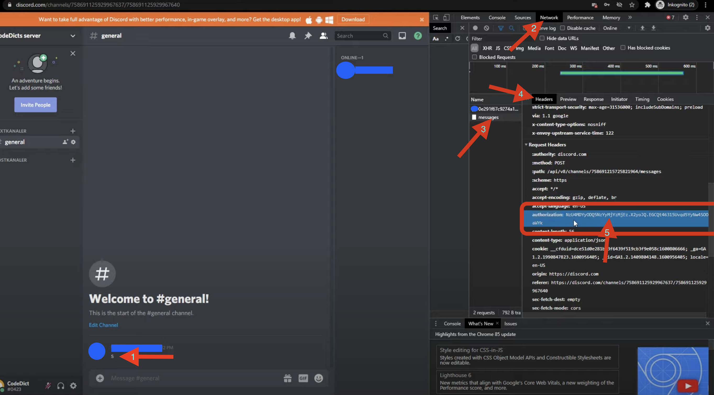
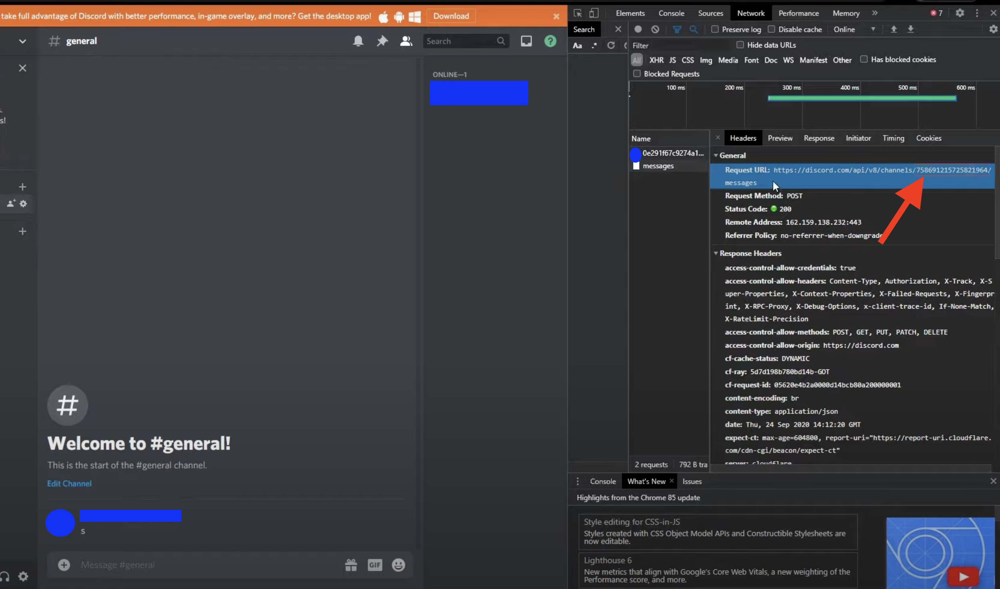

# send_discord_message-picture-files_with_python


### Description :

This code is for to send message and or files on discord

# Prerequisite :

## User's Token authorization

You must have the user's authorization of your account.
* send a message on any channel
* go to Network
* go on the request "message"
* copy the authorization key
```
header = {
    'authorization': " PAST YOUR AUTHORISAZATION HERE ",
}
```



## Get id of discord channel

Take id of channels you whant to send message
* same start of authorization key
* take the numbers like you see on the screen

```
channel1 = "000000000000000000"
channel2 = "000000000000000000"
...
```




## Payload

* Enter your message
```
payload = {
    "content": "your message"
}
```


## Files 

* Enter path of your files
```
  a="your_file.txt"
  b="your_file.png"
  c="your_file.pdf"
  ...
```


## Authors

sylvOr the 5 March 2023


## Source

* [Codium](https://www.youtube.com/watch?v=DArlLAq56Mo&ab_channel=Codium) for the screen


## License

This project is licensed under the [MIT License](http://en.wikipedia.org/wiki/MIT_License) - see the LICENSE.md file for details

